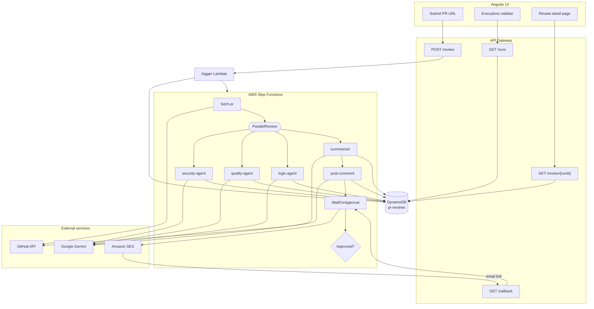

# PR Review Multi-Agent System

> Serverless AI pipeline that reviews GitHub pull requests with specialized agents, posts structured feedback, and routes final approval through a human-in-the-loop gate.

Paste a PR URL → three AI agents analyze the diff in parallel → a summarizer produces a GitHub-ready review → the comment is posted → a manager approves or rejects via email → the pipeline completes.

Built to run on **AWS Free Tier** with no containers, no always-on servers, and no orchestration frameworks.

---

## Why this project exists

Manual PR reviews are slow and inconsistent. Fully autonomous AI reviews can post low-quality or risky comments without oversight.

This system combines both approaches:

- **Speed** — parallel specialist agents (security, quality, logic)
- **Structure** — each agent has a focused system prompt and JSON schema
- **Accountability** — human approval gate before the pipeline is marked complete
- **Observability** — every run is tracked in DynamoDB with live UI polling

---

## Architecture



---

## Key design decisions

| Decision | Rationale |
|----------|-----------|
| **AWS Step Functions** over custom queue/worker code | Native parallel states, error handling, and `waitForTaskToken` for human approval without building a state machine from scratch |
| **Three specialist agents in parallel** | Security, quality, and logic require different prompts; parallel execution cuts review latency ~3× vs sequential |
| **DynamoDB as run state store** | Enables frontend polling (`GET /review/{runId}`) and execution history (`GET /runs`) without coupling UI to Step Functions |
| **Lambda Layer for Gemini SDK** | Keeps function zips under 50 MB console upload limit; shared dependency layer attached to 4 AI functions |
| **Secrets Manager for API keys** | Gemini and GitHub tokens never baked into deployment artifacts |
| **SES + callback Lambda for approval** | Manager approves from email; `SendTaskSuccess` / `SendTaskFailure` resumes the state machine — no auth UI needed for v1 |
| **Specialist prompts return JSON** | Structured findings per agent → summarizer merges into consistent Markdown for GitHub |
| **No LangChain / CrewAI** | Plain Python + boto3 keeps cold starts fast and dependencies minimal on Lambda |

---

## Tech stack

| Layer | Technology |
|-------|------------|
| **Orchestration** | AWS Step Functions (Standard) |
| **Compute** | AWS Lambda (Python 3.14) |
| **API** | API Gateway (REST) |
| **Database** | DynamoDB |
| **Secrets** | AWS Secrets Manager |
| **Email** | Amazon SES |
| **LLM** | Google Gemini (`gemini-2.5-flash-lite`) |
| **Integrations** | GitHub REST API |
| **Frontend** | Angular 19 (standalone components) |
| **Frontend hosting** | Vercel (static) |

---

## Pipeline stages

| Stage | Lambda | What it does |
|-------|--------|--------------|
| 1 | `trigger` | Creates DynamoDB record, starts Step Functions |
| 2 | `fetch-pr` | Pulls PR diff from GitHub |
| 3 | `security-agent` | Gemini review — vulnerabilities, secrets, injection |
| 4 | `quality-agent` | Gemini review — naming, DRY, readability |
| 5 | `logic-agent` | Gemini review — bugs, edge cases, race conditions |
| 6 | `summarizer` | Merges agent JSON → single Markdown comment |
| 7 | `post-comment` | Posts review to GitHub PR |
| 8 | `approval` | Sends SES email with approve/reject links |
| 9 | `callback` | Handles human decision → resumes Step Functions |

**Status lifecycle:** `STARTED` → `FETCHING` → `REVIEWING` → `SUMMARIZING` → `POSTING_COMMENT` → `AWAITING_APPROVAL` → `APPROVED` / `REJECTED` / `FAILED`

---

## API endpoints

| Method | Path | Description |
|--------|------|-------------|
| `POST` | `/review` | Start a new review (`{ "prUrl": "..." }`) |
| `GET` | `/review/{runId}` | Poll run status and findings |
| `GET` | `/runs` | List all executions (sidebar) |
| `GET` | `/callback` | Human approval callback from email link |

---

## Project structure

```
pr-review-agent/
├── backend/
│   ├── shared/
│   │   ├── gemini_client.py      # LLM calls with retry + JSON fallback
│   │   ├── github_client.py      # Fetch diff, post comment
│   │   └── dynamo_client.py      # Run state CRUD
│   ├── lambdas/
│   │   ├── trigger/                # API entry + list runs
│   │   ├── fetch_pr/
│   │   ├── security_agent/
│   │   ├── quality_agent/
│   │   ├── logic_agent/
│   │   ├── summarizer/
│   │   ├── post_comment/
│   │   ├── approval/
│   │   └── callback/
│   └── step_functions/
│       └── state_machine.json
├── frontend/pr-review-ui/          # Angular app
│   └── src/app/
│       ├── submit.component.ts     # PR URL form
│       ├── review.component.ts     # Live status + findings
│       └── executions-sidebar.component.ts
├── scripts/
│   ├── package_lambdas.sh          # Build zips + Gemini layer
│   └── test_gemini_local.py        # Local LLM smoke test
├── .env.example
└── README.md
```

---

## Quick start (local)

### Prerequisites

- Python 3.12+
- Node.js 18+
- AWS account (for deployment)
- Gemini API key, GitHub PAT

### Backend

```bash
cp .env.example .env              # add your keys (never commit .env)
python -m venv .venv && source .venv/bin/activate
pip install -r requirements.txt
python scripts/test_gemini_local.py
```

### Frontend

```bash
cd frontend/pr-review-ui
npm install
# Set apiBaseUrl in src/environments/environment.ts to your API Gateway URL
npm start                           # http://localhost:4200
```

---

## Deploy to AWS

### 1. Package Lambdas

```bash
chmod +x scripts/package_lambdas.sh
PYTHON_VERSION=3.14 ./scripts/package_lambdas.sh
```

Outputs:
- `dist/lambdas/*.zip` — slim handler zips (upload to each Lambda)
- `dist/layer/pr-review-gemini-layer.zip` — attach to 4 AI Lambdas

### 2. AWS resources (in order)

1. **Secrets Manager** — `pr-review/gemini-key`, `pr-review/github-token`
2. **DynamoDB** — table `pr-reviews`, partition key `runId` (String)
3. **SES** — verify sender + approver emails
4. **IAM role** — Lambda execution role (DynamoDB, Secrets Manager, SES, Step Functions)
5. **9 Lambda functions** — handler `handler.handler`, attach Gemini layer to AI functions
6. **Step Functions** — paste `state_machine.json` (replace `REGION`, `ACCOUNT_ID`)
7. **API Gateway** — routes above, enable CORS, deploy to `prod`
8. **Frontend** — `npm run build`, deploy to Vercel

### Lambda environment variables

| Function | Variables |
|----------|-----------|
| All | `DYNAMODB_TABLE=pr-reviews` |
| `trigger` | `STATE_MACHINE_ARN` |
| AI agents + summarizer | `GEMINI_MODEL=gemini-2.5-flash-lite` |
| `approval` | `SES_SENDER_EMAIL`, `APPROVER_EMAIL`, `API_BASE_URL` |
| `callback` | `APPROVER_EMAIL` |

> Gemini and GitHub keys are read from **Secrets Manager** in production — not set as Lambda env vars.

---

## Frontend features

- **Submit page** — paste GitHub PR URL, starts pipeline
- **Review page** — polls status every 5s until terminal state; shows per-agent findings, final Markdown, GitHub comment link
- **Executions sidebar** — lists all runs from DynamoDB, refreshes every 10s, click to navigate

---

## What I learned building this

1. **Step Functions task tokens** are powerful for human-in-the-loop workflows but require URL-encoding tokens in email links
2. **Lambda layer packaging** is essential when Python ML SDKs exceed the 50 MB console upload limit
3. **Parallel AI agents** improve latency but multiply API quota usage (4 Gemini calls per PR)
4. **GitHub PR comments use the Issues API** — tokens need `Issues: Read and write`, not just pull read access
5. **Serverless state management** — DynamoDB as a "clipboard" decouples the UI from Step Functions internals

---

## Future improvements

- [ ] LLM provider abstraction (DeepSeek / Kimi fallback)
- [ ] Infrastructure as Code (CDK / Terraform)
- [ ] Sequential agent mode to reduce API quota usage
- [ ] Signed approval tokens instead of raw Step Functions task tokens in URLs
- [ ] API authentication (API keys or Cognito)
- [ ] GitHub Actions trigger on PR open
- [ ] pytest suite with mocked boto3 / GitHub / Gemini

---

## License

MIT
